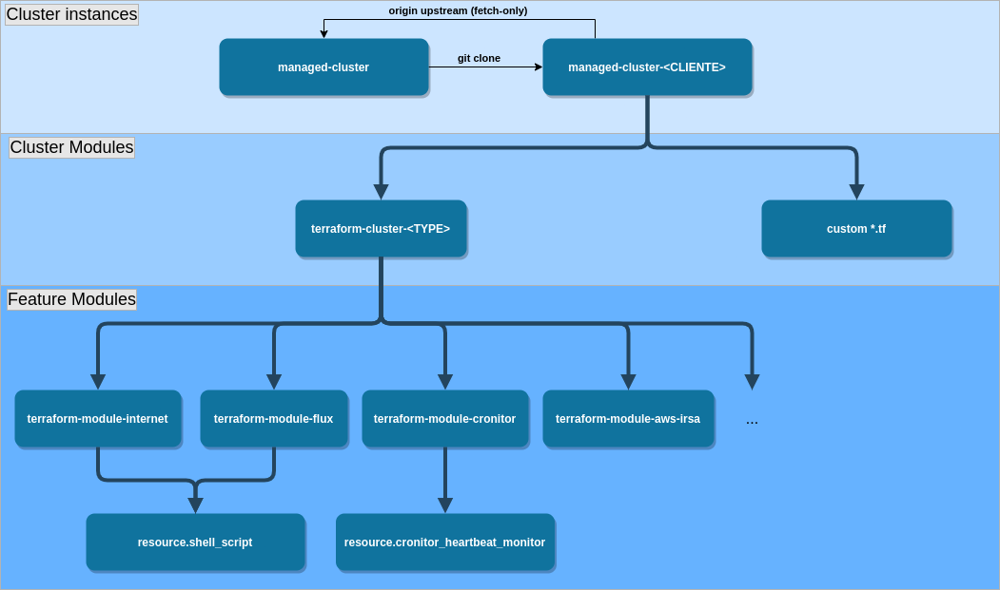

# Creating a cluster

## Architecture



## Bootstrap from base repository

Clone this repo and give it a meaningful name:

```sh
$ git clone git@github.com:getupcloud/managed-cluster.git managed-cluster-evilcorp
                                                          ^^^^^^^^^^^^^^^^^^^^^^^^

$ cd managed-cluster-evilcorp
```

Bootstrap an initial config for a new cluster named `production`:

```sh
$ ./managed-cluster create
```

All cluster configs will be stored in an exclusive directory `./clusters/${CUSTOMER_NAME}/${CLUSTER_NAME}`.

## Start installer container

We are now ready to create our cluster. Let's start the installer container.

```sh
$ ./managed-cluster start
```

There are two volumes mapped from local host into container's filesystem:

- `./clusters/${CUSTOMER_NAME}/${CLUSTER_NAME}` -> `/cluster`
- `./` -> `/repo`

A new `/cluster/terraform.tfvars` will be generated case none is found.
You will be asked to fill in non-default values. After that, if you need to update/change values from `terraform.tfvars` simply run `terraform-edit`
or `vim /cluster/terraform.tfvars`.

> In order to re-generate `terraform.tfvars`, run `terraform-setup -f`.
> Any manually-edited values in this file will be lost.

## Apply terraform

We can now create our cluster using terraform. Run this to init, verify, apply and check the new cluster:

```
$ terraform-apply
```

After terraform finishes, you will be asked to create a github repo and push this repo into it.

Flux will be installed and configured to sync from `${GITHUB_REPO}/clusters/${CUSTOMER_NAME}/${CLUSTER_NAME}/manifests/cluster/kustomization.yaml`.

## Updating the cluster

In order to update any config, simply `terraform-edit` and then `terraform-apply`.

You are free to edit/add/remove anything from `/cluster` (or `clusters/${CUSTOMER_NAME}/${CLUSTER_NAME}` if you are from out of the container).
